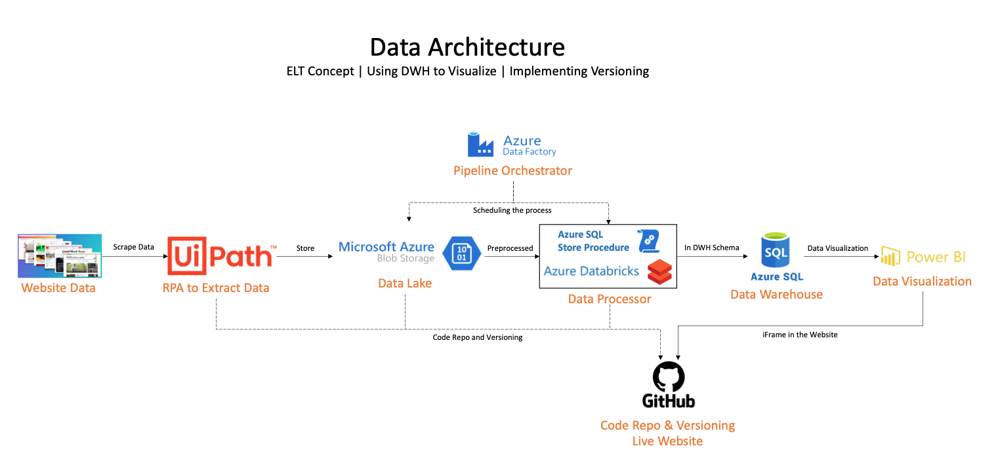
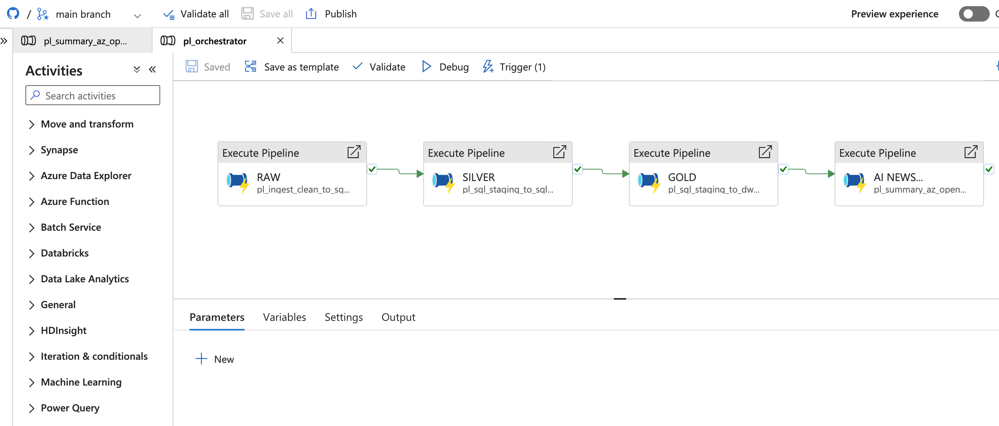

## 👤 Author

**Markus Lasroha Oppusunggu**  
- 💼 [LinkedIn](https://www.linkedin.com/in/markus-oppusunggu/)  
- 💻 [GitHub](https://github.com/u2600038142-sys)  
- ✉️ [Email](mailto:oppusunggu.markus@gmail.com)  

# 📊 NewsPulse Dashboard

End-to-end **data pipeline & analytics** project on **Microsoft Azure**.  
Scrape global news → cleanse → load to a SQL data warehouse → visualize in Power BI → publish via GitHub Pages.

**Live demo:** https://u2600038142-sys.github.io/newspulse-dashboard/

---

## ⚡ Architecture



**Flow (high-level):**
1. **Scraping** — UiPath fetches Reuters “World” news (past 24h) → CSV.
2. **Landing Zone** — CSV stored in Azure Blob (`raw/`).
3. **Cleansing** — Azure Databricks (PySpark) cleans multipart noise → valid CSV in `clean/`.
4. **Orchestration** — Azure Data Factory:
   - Truncate staging (SQL SP)
   - Run Databricks notebook (cleansing)
   - Copy clean CSV → Azure SQL staging
   - Load DWH via stored procedure
5. **Data Warehouse** — Azure SQL (star schema: `dim_date`, `dim_source`, `fact_article`).
6. **Visualization** — Power BI connected to DWH.
7. **Publishing** — Power BI report embedded in `index.html` (GitHub Pages).
8. **NewsSummarywithAI** - Azure AI Foundry with OpenAI GPT4 model.

---

## 🛠️ Tech Stack

- **UiPath** — News scraping automation  
- **Azure Blob Storage** — Raw & clean file store  
- **Azure Databricks (PySpark)** — Data cleansing/transforms  
- **Azure Data Factory** — Orchestration & scheduling  

- **Azure SQL Database** — Staging & DWH (star schema)  
- **Power BI** — Interactive dashboard  
- **GitHub Pages** — Public web hosting
- **Azure AI Foundry** - Creating AI for news summary

---

## 🚀 Pipeline Details

### 1) Ingestion (UiPath → Blob)
- Output CSV schema: `source_name, source_url, title`
- Path: `raw/ingest_date=YYYY-MM-DD/source=reuters/*.csv`

### 2) Cleansing (Databricks, PySpark)
- Read as **text** → filter multipart boundaries / headers
- Reparse for a CSV valid (quote support, multiline)
- save to `clean/ingest_date=YYYY-MM-DD/source=reuters/clean_reuters.csv`

### 3) Orchestration (ADF)
Activities (sequences):
1. **Stored Procedure** → `dbo.sp_truncate_staging` (atau `sp_clear_staging_by_date`)
2. **Databricks Notebook** → `nb_clean_news` (params: `p_date`, `p_source`)
3. **Copy Data** → Blob `clean/*.csv` → SQL `dbo.staging_fact_article`
4. **Stored Procedure** → `dwh.sp_load_articles_from_staging` (load DWH)

### 4) Data Warehouse (Azure SQL)
Schema `dwh`:
- `dim_date(date_key PK, full_date, year, month, month_name, day, weekday_name)`
- `dim_source(source_id PK, source_name, source_url)`
- `fact_article(article_id PK, date_key FK, source_id FK, title, load_ts)`

### 5) AI News Summary (Azure AI Foundry)
Model OpenAI GPT4

Indexing:
```sql
-- Staging
CREATE INDEX IX_staging_ingestdate ON dbo.staging_fact_article(ingest_date);

-- DWH
CREATE UNIQUE INDEX UX_dim_source_name_url ON dwh.dim_source(source_name, source_url);
CREATE INDEX IX_fact_article_date_source ON dwh.fact_article(date_key, source_id);